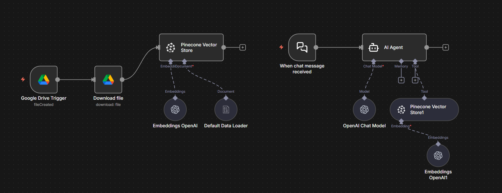
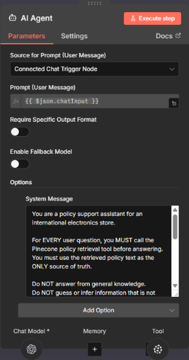
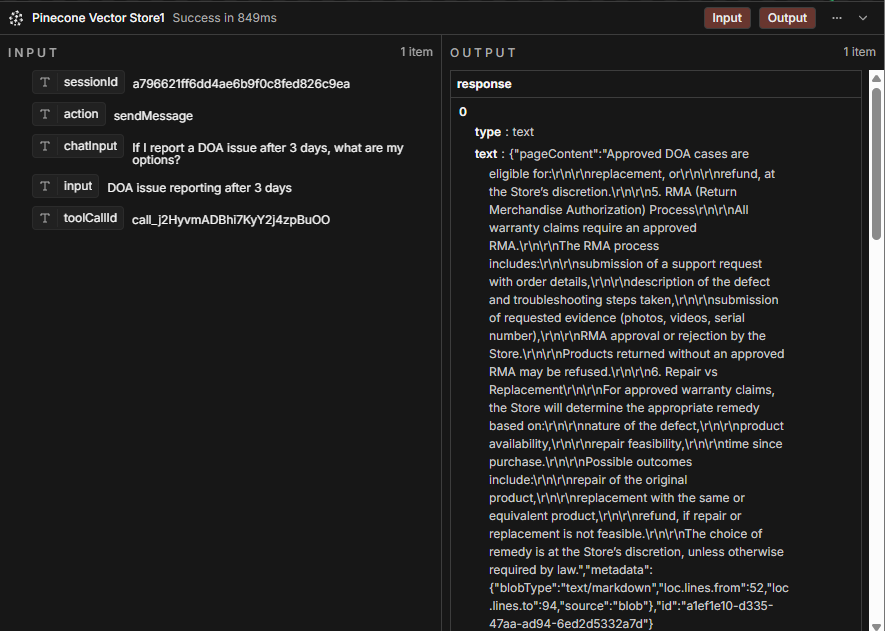

# RAG Policy Chatbot (n8n + Pinecone)

This repository contains a **Retrieval-Augmented Generation (RAG) chatbot** built as a **portfolio project**, demonstrating how structured policy documents can be queried using a strict retrieval-first AI agent.

The system is designed to always retrieve relevant policy content from a vector database before answering, preventing hallucinations and generic responses.

---

## ✨ Project Goal

The goal of this project is to demonstrate:

- A clean **RAG architecture** using n8n as the orchestration layer  
- A **disciplined AI agent** that answers strictly from retrieved documents  
- Practical usage of **Pinecone** as a vector database  
- Realistic **customer-support policy scenarios** (returns, warranty, shipping, DOA, customs)

This is not a toy chatbot — it is structured to behave like a real internal or customer-facing policy assistant.

---

## 🧠 How It Works (High-Level)

1. Policy documents (Markdown files) are embedded using OpenAI embeddings  
2. All embeddings are stored in **a single Pinecone namespace**  
3. An AI Agent in n8n receives a user question  
4. The agent is explicitly instructed to:
   - always retrieve relevant policy chunks from Pinecone  
   - answer **only** using the retrieved text  
5. If the information is not found in the policies, the agent responds accordingly

This ensures **grounded, policy-based answers** without relying on general model knowledge.

---

## 🧩 Architecture Overview



The workflow is orchestrated using **n8n**, with clear separation between:
- ingestion  
- retrieval  
- reasoning  
- response generation  

---

## 🤖 AI Agent Configuration



The AI Agent is configured with a strict system message that enforces:
- retrieval-first behavior  
- no use of general knowledge  
- policy-only answers  

This is a key part of the RAG discipline demonstrated in this project.

---

## 🔎 Vector Retrieval Example



The Pinecone Vector Store returns relevant policy chunks (including metadata such as line ranges), which are then used by the agent to generate responses.

---

## 📂 Repository Structure

```text
rag-policy-chatbot-n8n/
├── README.md
├── workflows/
│   └── RAG_Pipeline_Chat_Bot.json
├── policies/
│   ├── store_policy_overview.md
│   ├── shipping_customs_restricted_items_policy.md
│   ├── returns_exchanges_restocking_fees_policy.md
│   ├── warranty_and_repairs_rma_policy.md
│   ├── support_sla_and_dispute_resolution_policy.md
│   ├── data_and_account_policy.md
│   └── faq.md
└── docs/
    └── screenshots/
        ├── workflow_overview.png
        ├── agent_node.png
        └── pinecone_output.png

## ⚙️ Technologies Used

- **n8n** – workflow orchestration and AI agent execution  
- **Pinecone** – vector database for document retrieval  
- **OpenAI Embeddings** – `text-embedding-3-small` (512-dimensional)  
- **OpenAI Chat Model** – `gpt-4.1-mini`  
- **Markdown** – policy document format  

All documents are indexed into a **single Pinecone namespace**.

---

## 🚀 How to Use

1. Import the workflow JSON into n8n:
workflows/RAG_Pipeline_Chat_Bot.json


2. Configure your own credentials in n8n:
- OpenAI  
- Pinecone  

3. Upload or modify policy documents if needed.

4. Run the workflow and interact with the chatbot.

> **Note:** No API keys or secrets are included in this repository.

---

## 👤 Author

**Nikola Petrovic**  
GitHub: https://github.com/NikolaPetrovicAi  
LinkedIn: https://www.linkedin.com/in/nikolapetrovicai/

